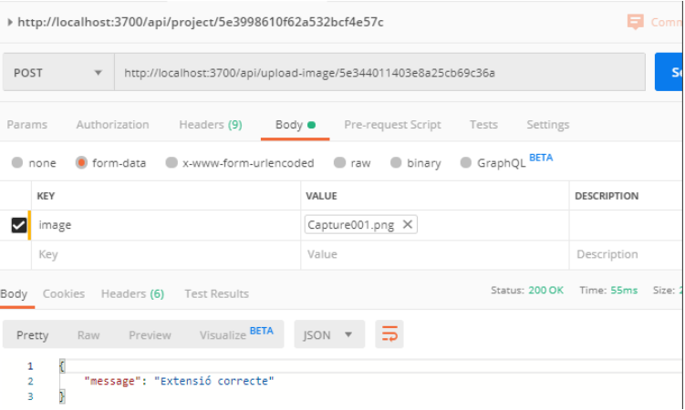

# 🌐 Upload images - Working with MongoBD and NodeJS

An application to learn how NodeJS works and how databases function in MongoDB. It implements the upload and download of images using Postman.

📅 This project was last updated on **May 20, 2019**.

---

## 🚀 Getting Started

Follow the steps below to get your project up and running:

### 1. **Run Node.js Project**
- Run `npm init -y`
    

### 2. **Install all dependencies**
   - Install anything that needs the project by runnning `npm install mongoose`

### 3. **Start MongoDB**
   - Run MongoDB server using `mongod`.

### 4. **Start server Node.js**
   - Run `node app.js`

### 5. **Install Postman**
- Depending on your operating system, install Postman accordingly:
   Windows: https://www.postman.com/downloads
   Linux: `sudo snap install postman`

---

## 🛠️ Prerequisites

- **NodeJs** Cross-platform runtime environment
- **npm** Package management system
- **mongoDB** NoSQL database system
- **Postman**  API platform

---

## 📖 Report

You can find the detailed project report in the following file:
- [BackEnd NodeJS-Preparació de l'entorn.pdf](BackEnd NodeJS-Preparació de l'entorn.pdf)

---

## 💻 Built With

- [MONGODB](https://www.mongodb.com/es/company/what-is-mongodb) - NoSQL database system
- [NodeJs](https://nodejs.org/es) - Cross-platform runtime environment
- [Postman](https://www.postman.com/) -  API platform

---

## ✨ Authors

- **Ana Valero Giraldez** - *Developer of the project*  
  You can reach me at [GitHub - AnaValero](https://github.com/anavagi)

---

## 📝 License

This project is licensed under the [MIT License](LICENSE.md) - see the LICENSE.md file for more details.

---

## 📸 Screenshots

---

## ⚡ Features

- 🔒 Upload and download of images
- ✍️ Working with Postman

## 📢 Feedback

Feel free to open issues or pull requests for improvements, or contact me for further suggestions!

